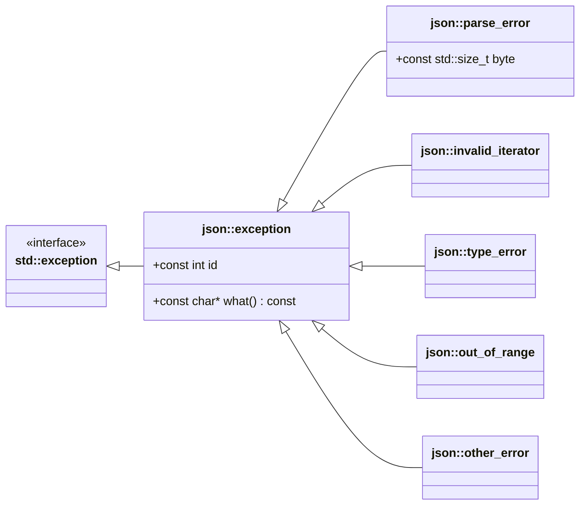
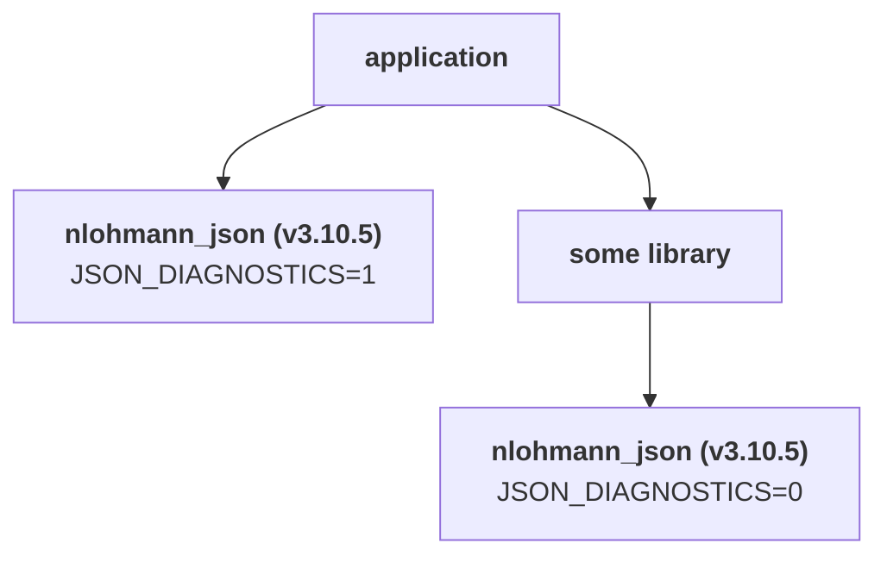
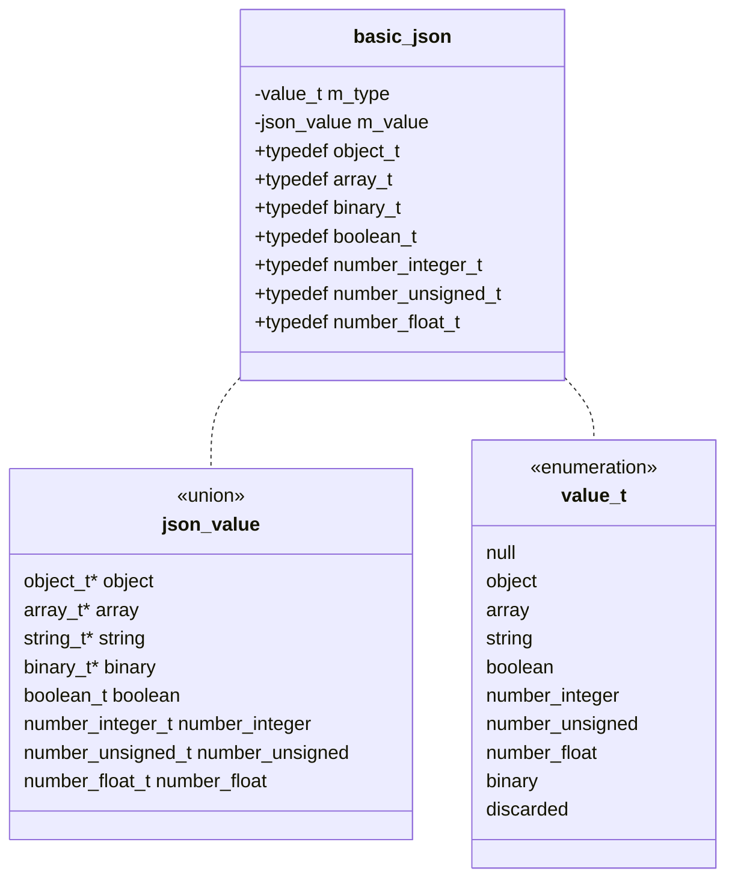

# Frequently Asked Questions (FAQ)

## Known bugs

### Brace initialization yields arrays

!!! question

    Why does

    ```cpp
    json j{true};
    ```

    and

    ```cpp
    json j(true);
    ```

    yield different results (`#!json [true]` vs. `#!json true`)?

This is a known issue, and -- even worse -- the behavior differs between GCC and Clang. The "culprit" for this is the library's constructor overloads for initializer lists to allow syntax like

```cpp
json array = {1, 2, 3, 4};
```

for arrays and

```cpp
json object = {{"one", 1}, {"two", 2}}; 
```

for objects.

!!! tip

    To avoid any confusion and ensure portable code, **do not** use brace initialization with the types `basic_json`, `json`, or `ordered_json` unless you want to create an object or array as shown in the examples above.

## Limitations

### Relaxed parsing

!!! question

    Can you add an option to ignore trailing commas?

This library does not support any feature that would jeopardize interoperability.


### Parse errors reading non-ASCII characters

!!! question "Questions"

    - Why is the parser complaining about a Chinese character?
    - Does the library support Unicode?
    - I get an exception `[json.exception.parse_error.101] parse error at line 1, column 53: syntax error while parsing value - invalid string: ill-formed UTF-8 byte; last read: '"Testé$')"`

The library supports **Unicode input** as follows:

- Only **UTF-8** encoded input is supported, which is the default encoding for JSON, according to [RFC 8259](https://tools.ietf.org/html/rfc8259.html#section-8.1).
- `std::u16string` and `std::u32string` can be parsed, assuming UTF-16 and UTF-32 encoding, respectively. These encodings are not supported when reading from files or other input containers.
- Other encodings such as Latin-1 or ISO 8859-1 are **not** supported and will yield parse or serialization errors.
- The library will not replace [Unicode noncharacters](http://www.unicode.org/faq/private_use.html#nonchar1).
- Invalid surrogates (e.g., incomplete pairs such as `\uDEAD`) will yield parse errors.
- The strings stored in the library are UTF-8 encoded. When using the default string type (`std::string`), note that its length/size functions return the number of stored bytes rather than the number of characters or glyphs.
- When you store strings with different encodings in the library, calling [`dump()`](https://nlohmann.github.io/json/classnlohmann_1_1basic__json_a50ec80b02d0f3f51130d4abb5d1cfdc5.html#a50ec80b02d0f3f51130d4abb5d1cfdc5) may throw an exception unless `json::error_handler_t::replace` or `json::error_handler_t::ignore` are used as error handlers.

In most cases, the parser is right to complain, because the input is not UTF-8 encoded. This is especially true for Microsoft Windows, where Latin-1 or ISO 8859-1 is often the standard encoding.


### Wide string handling

!!! question

    Why are wide strings (e.g., `std::wstring`) dumped as arrays of numbers?

As described [above](#parse-errors-reading-non-ascii-characters), the library assumes UTF-8 as encoding.  To store a wide string, you need to change the encoding.

!!! example

    ```cpp
    #include <codecvt> // codecvt_utf8
    #include <locale>  // wstring_convert
    
    // encoding function
    std::string to_utf8(std::wstring& wide_string)
    {
        static std::wstring_convert<std::codecvt_utf8<wchar_t>> utf8_conv;
        return utf8_conv.to_bytes(wide_string);
    }
    
    json j;
    std::wstring ws = L"車B1234 こんにちは";
    
    j["original"] = ws;
    j["encoded"] = to_utf8(ws);
    
    std::cout << j << std::endl;
    ```
    
    The result is:
    
    ```json
    {
      "encoded": "車B1234 こんにちは",
      "original": [36554, 66, 49, 50, 51, 52, 32, 12371, 12435, 12395, 12385, 12399]
    }
    ```

## Exceptions

### Parsing without exceptions

!!! question

    Is it possible to indicate a parse error without throwing an exception?

Yes, see [Parsing and exceptions](../features/parsing/parse_exceptions.md).


### Key name in exceptions

!!! question

    Can I get the key of the object item that caused an exception?

Yes, you can. Please define the symbol [`JSON_DIAGNOSTICS`](../api/macros/json_diagnostics.md) to get [extended diagnostics messages](exceptions.md#extended-diagnostic-messages).


## Serialization issues


### Number precision

!!! question

    - It seems that precision is lost when serializing a double.
    - Can I change the precision for floating-point serialization?

The library uses `std::numeric_limits<number_float_t>::digits10` (15 for IEEE `double`s) digits for serialization. This value is sufficient to guarantee roundtripping. If one uses more than this number of digits of precision, then string -> value -> string is not guaranteed to round-trip.

!!! quote "[cppreference.com](https://en.cppreference.com/w/cpp/types/numeric_limits/digits10)"

    The value of `std::numeric_limits<T>::digits10` is the number of base-10 digits that can be represented by the type T without change, that is, any number with this many significant decimal digits can be converted to a value of type T and back to decimal form, without change due to rounding or overflow. 

!!! tip

    The website https://float.exposed gives a good insight into the internal storage of floating-point numbers.

See [this section](../features/types/number_handling.md#number-serialization) on the library's number handling for more information.

## Compilation issues

### Android SDK

!!! question

    Why does the code not compile with Android SDK?

Android defaults to using very old compilers and C++ libraries. To fix this, add the following to your `Application.mk`. This will switch to the LLVM C++ library, the Clang compiler, and enable C++11 and other features disabled by default.

```ini
APP_STL := c++_shared
NDK_TOOLCHAIN_VERSION := clang3.6
APP_CPPFLAGS += -frtti -fexceptions
```

The code compiles successfully with [Android NDK](https://developer.android.com/ndk/index.html?hl=ml), Revision 9 - 11 (and possibly later) and [CrystaX's Android NDK](https://www.crystax.net/en/android/ndk) version 10.


### Missing STL function

!!! question "Questions"

    - Why do I get a compilation error `'to_string' is not a member of 'std'` (or similarly, for `strtod` or `strtof`)?
    - Why does the code not compile with MinGW or Android SDK?

This is not an issue with the code, but rather with the compiler itself. On Android, see above to build with a newer environment.  For MinGW, please refer to [this site](http://tehsausage.com/mingw-to-string) and [this discussion](https://github.com/nlohmann/json/issues/136) for information on how to fix this bug. For Android NDK using `APP_STL := gnustl_static`, please refer to [this discussion](https://github.com/nlohmann/json/issues/219).


***

# Exceptions

## Overview

### Base type

All exceptions inherit from class `json::exception` (which in turn inherits from `std::exception`). It is used as the base class for all exceptions thrown by the `basic_json` class. This class can hence be used as "wildcard" to catch exceptions.



### Switch off exceptions

Exceptions are used widely within the library. They can, however, be switched off with either using the compiler flag `-fno-exceptions` or by defining the symbol [`JSON_NOEXCEPTION`](../api/macros/json_noexception.md). In this case, exceptions are replaced by `abort()` calls. You can further control this behavior by defining `JSON_THROW_USER` (overriding `#!cpp throw`), `JSON_TRY_USER` (overriding `#!cpp try`), and `JSON_CATCH_USER` (overriding `#!cpp catch`).

Note that [`JSON_THROW_USER`](../api/macros/json_throw_user.md) should leave the current scope (e.g., by throwing or aborting), as continuing after it may yield undefined behavior.

??? example

    The code below switches off exceptions and creates a log entry with a detailed error message in case of errors.

    ```cpp
    #include <iostream>
    
    #define JSON_TRY_USER if(true)
    #define JSON_CATCH_USER(exception) if(false)
    #define JSON_THROW_USER(exception)                           \
        {std::clog << "Error in " << __FILE__ << ":" << __LINE__ \
                   << " (function " << __FUNCTION__ << ") - "    \
                   << (exception).what() << std::endl;           \
         std::abort();}
    
    #include <nlohmann/json.hpp>
    ```

Note the explanatory [`what()`](https://en.cppreference.com/w/cpp/error/exception/what) string of exceptions is not available for MSVC if exceptions are disabled, see [#2824](https://github.com/nlohmann/json/discussions/2824).

See [documentation of `JSON_TRY_USER`, `JSON_CATCH_USER` and `JSON_THROW_USER`](../api/macros/json_throw_user.md) for more information.

### Extended diagnostic messages

Exceptions in the library are thrown in the local context of the JSON value they are detected. This makes detailed diagnostics messages, and hence debugging, difficult.

??? example

    ```cpp
    --8<-- "examples/diagnostics_standard.cpp"
    ```
    
    Output:

    ```
    --8<-- "examples/diagnostics_standard.output"
    ```

    This exception can be hard to debug if storing the value `#!c "12"` and accessing it is further apart.

To create better diagnostics messages, each JSON value needs a pointer to its parent value such that a global context (i.e., a path from the root value to the value that led to the exception) can be created. That global context is provided as [JSON Pointer](../features/json_pointer.md).

As this global context comes at the price of storing one additional pointer per JSON value and runtime overhead to maintain the parent relation, extended diagnostics are disabled by default. They can, however, be enabled by defining the preprocessor symbol [`JSON_DIAGNOSTICS`](../api/macros/json_diagnostics.md) to `1` before including `json.hpp`.

??? example

    ```cpp
    --8<-- "examples/diagnostics_extended.cpp"
    ```
    
    Output:

    ```
    --8<-- "examples/diagnostics_extended.output"
    ```

    Now the exception message contains a JSON Pointer `/address/housenumber` that indicates which value has the wrong type.

See [documentation of `JSON_DIAGNOSTICS`](../api/macros/json_diagnostics.md) for more information.

## Parse errors

The library throws this exception when a parse error occurs. Parse errors
can occur during the deserialization of JSON text, CBOR, MessagePack, as well
as when using JSON Patch.

Exceptions have ids 1xx.

!!! info "Byte index"

    Member `byte` holds the byte index of the last read character in the input
    file.

    For an input with n bytes, 1 is the index of the first character and n+1
    is the index of the terminating null byte or the end of file. This also
    holds true when reading a byte vector (CBOR or MessagePack).

??? example

    The following code shows how a `parse_error` exception can be caught.

    ```cpp
    --8<-- "examples/parse_error.cpp"
    ```
    
    Output:

    ```
    --8<-- "examples/parse_error.output"
    ```


### json.exception.parse_error.101

This error indicates a syntax error while deserializing a JSON text. The error message describes that an unexpected token (character) was encountered, and the member `byte` indicates the error position.

!!! failure "Example message"

    Input ended prematurely:

    ```
    [json.exception.parse_error.101] parse error at 2: unexpected end of input; expected string literal
    ```

    No input:

    ```
    [json.exception.parse_error.101] parse error at line 1, column 1: attempting to parse an empty input; check that your input string or stream contains the expected JSON
    ```

    Control character was not escaped:

    ```
    [json.exception.parse_error.101] parse error at line 1, column 2: syntax error while parsing value - invalid string: control character U+0009 (HT) must be escaped to \u0009 or \\; last read: '"<U+0009>'"
    ```

    String was not closed:

    ```
    [json.exception.parse_error.101] parse error at line 1, column 2: syntax error while parsing value - invalid string: missing closing quote; last read: '"'
    ```

    Invalid number format:

    ```
    [json.exception.parse_error.101] parse error at line 1, column 3: syntax error while parsing value - invalid number; expected '+', '-', or digit after exponent; last read: '1E'
    ```

    `\u` was not be followed by four hex digits:

    ```
    [json.exception.parse_error.101] parse error at line 1, column 6: syntax error while parsing value - invalid string: '\u' must be followed by 4 hex digits; last read: '"\u01"'
    ```

    Invalid UTF-8 surrogate pair:

    ```
    [json.exception.parse_error.101] parse error at line 1, column 13: syntax error while parsing value - invalid string: surrogate U+DC00..U+DFFF must follow U+D800..U+DBFF; last read: '"\uD7FF\uDC00'"
    ```

    Invalid UTF-8 byte:

    ```
    [json.exception.parse_error.101] parse error at line 3, column 24: syntax error while parsing value - invalid string: ill-formed UTF-8 byte; last read: '"vous \352t'
    ```

!!! tip

    - Make sure the input is correctly read. Try to write the input to standard output to check if, for instance, the input file was successfully opened.
    - Paste the input to a JSON validator like <http://jsonlint.com> or a tool like [jq](https://stedolan.github.io/jq/).

### json.exception.parse_error.102

JSON uses the `\uxxxx` format to describe Unicode characters. Code points above 0xFFFF are split into two `\uxxxx` entries ("surrogate pairs"). This error indicates that the surrogate pair is incomplete or contains an invalid code point.

!!! failure "Example message"

    ```
    parse error at 14: missing or wrong low surrogate
    ```

!!! note

    This exception is not used any more. Instead [json.exception.parse_error.101](#jsonexceptionparse_error101) with a more detailed description is used.

### json.exception.parse_error.103

Unicode supports code points up to 0x10FFFF. Code points above 0x10FFFF are invalid.

!!! failure "Example message"

    ```
    parse error: code points above 0x10FFFF are invalid
    ```

!!! note

    This exception is not used any more. Instead [json.exception.parse_error.101](#jsonexceptionparse_error101) with a more detailed description is used.

### json.exception.parse_error.104

[RFC 6902](https://tools.ietf.org/html/rfc6902) requires a JSON Patch document to be a JSON document that represents an array of objects.

!!! failure "Example message"

    ```
    [json.exception.parse_error.104] parse error: JSON patch must be an array of objects
    ```

### json.exception.parse_error.105

An operation of a JSON Patch document must contain exactly one "op" member, whose value indicates the operation to perform. Its value must be one of "add", "remove", "replace", "move", "copy", or "test"; other values are errors.

!!! failure "Example message"

    ```
    [json.exception.parse_error.105] parse error: operation 'add' must have member 'value'
    ```
    ```
    [json.exception.parse_error.105] parse error: operation 'copy' must have string member 'from'
    ```
    ```
    [json.exception.parse_error.105] parse error: operation value 'foo' is invalid
    ```

### json.exception.parse_error.106

An array index in a JSON Pointer ([RFC 6901](https://tools.ietf.org/html/rfc6901)) may be `0` or any number without a leading `0`.

!!! failure "Example message"

    ```
    [json.exception.parse_error.106] parse error: array index '01' must not begin with '0'
    ```

### json.exception.parse_error.107

A JSON Pointer must be a Unicode string containing a sequence of zero or more reference tokens, each prefixed by a `/` character.

!!! failure "Example message"

    ```
    [json.exception.parse_error.107] parse error at byte 1: JSON pointer must be empty or begin with '/' - was: 'foo'
    ```

### json.exception.parse_error.108

In a JSON Pointer, only `~0` and `~1` are valid escape sequences.

!!! failure "Example message"

    ```
    [json.exception.parse_error.108] parse error: escape character '~' must be followed with '0' or '1'
    ```

### json.exception.parse_error.109

A JSON Pointer array index must be a number.

!!! failure "Example messages"

    ```
    [json.exception.parse_error.109] parse error: array index 'one' is not a number
    ```
    ```
    [json.exception.parse_error.109] parse error: array index '+1' is not a number
    ```

### json.exception.parse_error.110

When parsing CBOR or MessagePack, the byte vector ends before the complete value has been read.

!!! failure "Example message"

    ```
    [json.exception.parse_error.110] parse error at byte 5: syntax error while parsing CBOR string: unexpected end of input
    ```
    ```
    [json.exception.parse_error.110] parse error at byte 2: syntax error while parsing UBJSON value: expected end of input; last byte: 0x5A
    ```

### json.exception.parse_error.112

An unexpected byte was read in a [binary format](../features/binary_formats/index.md) or length information is invalid ([BSON](../features/binary_formats/bson.md)).

!!! failure "Example messages"

    ```
    [json.exception.parse_error.112] parse error at byte 1: syntax error while parsing CBOR value: invalid byte: 0x1C
    ```
    ```
    [json.exception.parse_error.112] parse error at byte 1: syntax error while parsing MessagePack value: invalid byte: 0xC1
    ```
    ```
    [json.exception.parse_error.112] parse error at byte 4: syntax error while parsing BJData size: expected '#' after type information; last byte: 0x02
    ```
    ```
    [json.exception.parse_error.112] parse error at byte 4: syntax error while parsing UBJSON size: expected '#' after type information; last byte: 0x02
    ```
    ```
    [json.exception.parse_error.112] parse error at byte 10: syntax error while parsing BSON string: string length must be at least 1, is -2147483648
    ```
    ```
    [json.exception.parse_error.112] parse error at byte 15: syntax error while parsing BSON binary: byte array length cannot be negative, is -1
    ```

### json.exception.parse_error.113

While parsing a map key, a value that is not a string has been read.

!!! failure "Example messages"

    ```
    [json.exception.parse_error.113] parse error at byte 2: syntax error while parsing CBOR string: expected length specification (0x60-0x7B) or indefinite string type (0x7F); last byte: 0xFF
    ```
    ```
    [json.exception.parse_error.113] parse error at byte 2: syntax error while parsing MessagePack string: expected length specification (0xA0-0xBF, 0xD9-0xDB); last byte: 0xFF
    ```
    ```
    [json.exception.parse_error.113] parse error at byte 2: syntax error while parsing UBJSON char: byte after 'C' must be in range 0x00..0x7F; last byte: 0x82
    ```

### json.exception.parse_error.114

The parsing of the corresponding BSON record type is not implemented (yet).

!!! failure "Example message"

    ```
    [json.exception.parse_error.114] parse error at byte 5: Unsupported BSON record type 0xFF
    ```

### json.exception.parse_error.115

A UBJSON high-precision number could not be parsed.

!!! failure "Example message"

    ```
    [json.exception.parse_error.115] parse error at byte 5: syntax error while parsing UBJSON high-precision number: invalid number text: 1A
    ```

## Iterator errors

This exception is thrown if iterators passed to a library function do not match
the expected semantics.

Exceptions have ids 2xx.

??? example

    The following code shows how an `invalid_iterator` exception can be caught.

    ```cpp
    --8<-- "examples/invalid_iterator.cpp"
    ```
    
    Output:

    ```
    --8<-- "examples/invalid_iterator.output"
    ```

### json.exception.invalid_iterator.201

The iterators passed to constructor `basic_json(InputIT first, InputIT last)` are not compatible, meaning they do not belong to the same container. Therefore, the range (`first`, `last`) is invalid.

!!! failure "Example message"

    ```
    [json.exception.invalid_iterator.201] iterators are not compatible
    ```

### json.exception.invalid_iterator.202

In the [erase](../api/basic_json/erase.md) or insert function, the passed iterator `pos` does not belong to the JSON value for which the function was called. It hence does not define a valid position for the deletion/insertion.

!!! failure "Example messages"

    ```
    [json.exception.invalid_iterator.202] iterator does not fit current value
    ```
    ```
    [json.exception.invalid_iterator.202] iterators first and last must point to objects
    ```

### json.exception.invalid_iterator.203

Either iterator passed to function [`erase(IteratorType first, IteratorType last`)](../api/basic_json/erase.md) does not belong to the JSON value from which values shall be erased. It hence does not define a valid range to delete values from.

!!! failure "Example message"

    ```
    [json.exception.invalid_iterator.203] iterators do not fit current value
    ```

### json.exception.invalid_iterator.204

When an iterator range for a primitive type (number, boolean, or string) is passed to a constructor or an [erase](../api/basic_json/erase.md) function, this range has to be exactly (`begin(),` `end()),` because this is the only way the single stored value is expressed. All other ranges are invalid.

!!! failure "Example message"

    ```
    [json.exception.invalid_iterator.204] iterators out of range
    ```

### json.exception.invalid_iterator.205

When an iterator for a primitive type (number, boolean, or string) is passed to an [erase](../api/basic_json/erase.md) function, the iterator has to be the `begin()` iterator, because it is the only way to address the stored value. All other iterators are invalid.

!!! failure "Example message"

    ```
    [json.exception.invalid_iterator.205] iterator out of range
    ```

### json.exception.invalid_iterator.206

The iterators passed to constructor `basic_json(InputIT first, InputIT last)` belong to a JSON null value and hence to not define a valid range.

!!! failure "Example message"

    ```
    [json.exception.invalid_iterator.206] cannot construct with iterators from null
    ```

### json.exception.invalid_iterator.207

The `key()` member function can only be used on iterators belonging to a JSON object, because other types do not have a concept of a key.

!!! failure "Example message"

    ```
    [json.exception.invalid_iterator.207] cannot use key() for non-object iterators
    ```


### json.exception.invalid_iterator.208

The `operator[]` to specify a concrete offset cannot be used on iterators belonging to a JSON object, because JSON objects are unordered.

!!! failure "Example message"

    ```
    [json.exception.invalid_iterator.208] cannot use operator[] for object iterators
    ```

### json.exception.invalid_iterator.209

The offset operators (`+`, `-`, `+=`, `-=`) cannot be used on iterators belonging to a JSON object, because JSON objects are unordered.

!!! failure "Example message"

    ```
    [json.exception.invalid_iterator.209] cannot use offsets with object iterators
    ```

### json.exception.invalid_iterator.210

The iterator range passed to the insert function is not compatible, meaning they do not belong to the same container. Therefore, the range (`first`, `last`) is invalid.

!!! failure "Example message"

    ```
    [json.exception.invalid_iterator.210] iterators do not fit
    ```

### json.exception.invalid_iterator.211

The iterator range passed to the insert function must not be a subrange of the container to insert to.

!!! failure "Example message"

    ```
    [json.exception.invalid_iterator.211] passed iterators may not belong to container
    ```

### json.exception.invalid_iterator.212

When two iterators are compared, they must belong to the same container.

!!! failure "Example message"

    ```
    [json.exception.invalid_iterator.212] cannot compare iterators of different containers
    ```

### json.exception.invalid_iterator.213

The order of object iterators cannot be compared, because JSON objects are unordered.

!!! failure "Example message"

    ```
    [json.exception.invalid_iterator.213] cannot compare order of object iterators
    ```

### json.exception.invalid_iterator.214

Cannot retrieve value from iterator: The iterator either refers to a null value, or it refers to a primitive type (number, boolean, or string), but does not match the iterator returned by `begin()`.

!!! failure "Example message"

    ```
    [json.exception.invalid_iterator.214] cannot get value
    ```

## Type errors

This exception is thrown in case of a type error; that is, a library function is executed on a JSON value whose type does not match the expected semantics.

Exceptions have ids 3xx.

??? example

    The following code shows how a `type_error` exception can be caught.

    ```cpp
    --8<-- "examples/type_error.cpp"
    ```
    
    Output:

    ```
    --8<-- "examples/type_error.output"
    ```

### json.exception.type_error.301

To create an object from an initializer list, the initializer list must consist only of a list of pairs whose first element is a string. When this constraint is violated, an array is created instead.

!!! failure "Example message"

    ```
    [json.exception.type_error.301] cannot create object from initializer list
    ```

### json.exception.type_error.302

During implicit or explicit value conversion, the JSON type must be compatible with the target type. For instance, a JSON string can only be converted into string types, but not into numbers or boolean types.

!!! failure "Example messages"

    ```
    [json.exception.type_error.302] type must be object, but is null
    ```
    ```
    [json.exception.type_error.302] type must be string, but is object
    ```

### json.exception.type_error.303

To retrieve a reference to a value stored in a `basic_json` object with `get_ref`, the type of the reference must match the value type. For instance, for a JSON array, the `ReferenceType` must be `array_t &`.

!!! failure "Example messages"

    ```
    [json.exception.type_error.303] incompatible ReferenceType for get_ref, actual type is object
    ```
    ```
    [json.exception.type_error.303] incompatible ReferenceType for get_ref, actual type is number"
    ```

### json.exception.type_error.304

The `at()` member functions can only be executed for certain JSON types.

!!! failure "Example messages"

    ```
    [json.exception.type_error.304] cannot use at() with string
    ```
    ```
    [json.exception.type_error.304] cannot use at() with number
    ```

### json.exception.type_error.305

The `operator[]` member functions can only be executed for certain JSON types.

!!! failure "Example messages"

    ```
    [json.exception.type_error.305] cannot use operator[] with a string argument with array
    ```
    ```
    [json.exception.type_error.305] cannot use operator[] with a numeric argument with object
    ```

### json.exception.type_error.306

The `value()` member functions can only be executed for certain JSON types.

!!! failure "Example message"

    ```
    [json.exception.type_error.306] cannot use value() with number
    ```

### json.exception.type_error.307

The [`erase()`](../api/basic_json/erase.md) member functions can only be executed for certain JSON types.

!!! failure "Example message"

    ```
    [json.exception.type_error.307] cannot use erase() with string
    ```

### json.exception.type_error.308

The `push_back()` and `operator+=` member functions can only be executed for certain JSON types.

!!! failure "Example message"

    ```
    [json.exception.type_error.308] cannot use push_back() with string
    ```

### json.exception.type_error.309

The `insert()` member functions can only be executed for certain JSON types.

!!! failure "Example messages"

    ```
    [json.exception.type_error.309] cannot use insert() with array
    ```
    ```
    [json.exception.type_error.309] cannot use insert() with number
    ```

### json.exception.type_error.310

The `swap()` member functions can only be executed for certain JSON types.

!!! failure "Example message"

    ```
    [json.exception.type_error.310] cannot use swap() with number
    ```

### json.exception.type_error.311

The `emplace()` and `emplace_back()` member functions can only be executed for certain JSON types.

!!! failure "Example messages"

    ```
    [json.exception.type_error.311] cannot use emplace() with number
    ```
    ```
    [json.exception.type_error.311] cannot use emplace_back() with number
    ```

### json.exception.type_error.312

The `update()` member functions can only be executed for certain JSON types.

!!! failure "Example message"

    ```
    [json.exception.type_error.312] cannot use update() with array
    ```

### json.exception.type_error.313

The `unflatten` function converts an object whose keys are JSON Pointers back into an arbitrary nested JSON value. The JSON Pointers must not overlap, because then the resulting value would not be well-defined.

!!! failure "Example message"

    ```
    [json.exception.type_error.313] invalid value to unflatten
    ```

### json.exception.type_error.314

The `unflatten` function only works for an object whose keys are JSON Pointers.

!!! failure "Example message"

    Calling `unflatten()` on an array `#!json [1,2,3]`:

    ```
    [json.exception.type_error.314] only objects can be unflattened
    ```

### json.exception.type_error.315

The `unflatten()` function only works for an object whose keys are JSON Pointers and whose values are primitive.

!!! failure "Example message"

    Calling `unflatten()` on an object `#!json {"/1", [1,2,3]}`:

    ```
    [json.exception.type_error.315] values in object must be primitive
    ```

### json.exception.type_error.316

The `dump()` function only works with UTF-8 encoded strings; that is, if you assign a `std::string` to a JSON value, make sure it is UTF-8 encoded.

!!! failure "Example message"

    Calling `dump()` on a JSON value containing an ISO 8859-1 encoded string:
    ```
    [json.exception.type_error.316] invalid UTF-8 byte at index 15: 0x6F
    ```

!!! tip

    - Store the source file with UTF-8 encoding.
    - Pass an error handler as last parameter to the `dump()` function to avoid this exception:
        - `json::error_handler_t::replace` will replace invalid bytes sequences with `U+FFFD` 
        - `json::error_handler_t::ignore` will silently ignore invalid byte sequences

### json.exception.type_error.317

The dynamic type of the object cannot be represented in the requested serialization format (e.g., a raw `true` or `null` JSON object cannot be serialized to BSON)

!!! failure "Example messages"

    Serializing `#!json null` to BSON:
    ```
    [json.exception.type_error.317] to serialize to BSON, top-level type must be object, but is null
    ```
    Serializing `#!json [1,2,3]` to BSON:
    ```
    [json.exception.type_error.317] to serialize to BSON, top-level type must be object, but is array
    ```

!!! tip

    Encapsulate the JSON value in an object. That is, instead of serializing `#!json true`, serialize `#!json {"value": true}`

## Out of range

This exception is thrown in case a library function is called on an input parameter that exceeds the expected range, for instance, in the case of array indices or nonexisting object keys.

Exceptions have ids 4xx.

??? example

    The following code shows how an `out_of_range` exception can be caught.

    ```cpp
    --8<-- "examples/out_of_range.cpp"
    ```
    
    Output:

    ```
    --8<-- "examples/out_of_range.output"
    ```

### json.exception.out_of_range.401

The provided array index `i` is larger than `size-1`.

!!! failure "Example message"

    ```
    array index 3 is out of range
    ```

### json.exception.out_of_range.402

The special array index `-` in a JSON Pointer never describes a valid element of the array, but the index past the end. That is, it can only be used to add elements at this position, but not to read it.

!!! failure "Example message"

    ```
    array index '-' (3) is out of range
    ```

### json.exception.out_of_range.403

The provided key was not found in the JSON object.

!!! failure "Example message"

    ```
    key 'foo' not found
    ```

### json.exception.out_of_range.404

A reference token in a JSON Pointer could not be resolved.

!!! failure "Example message"

    ```
    unresolved reference token 'foo'
    ```

### json.exception.out_of_range.405

The JSON Patch operations 'remove' and 'add' cannot be applied to the root element of the JSON value.

!!! failure "Example message"

    ```
    JSON pointer has no parent
    ```

### json.exception.out_of_range.406

A parsed number could not be stored as without changing it to NaN or INF.

!!! failure "Example message"

    ```
    number overflow parsing '10E1000'
    ```

### json.exception.out_of_range.407

This exception previously indicated that the UBJSON and BSON binary formats did not support integer numbers greater than
9223372036854775807 due to limitations in the implemented mapping. However, these limitations have since been resolved,
and this exception no longer occurs.

!!! success "Exception cannot occur any more"

    - Since version 3.9.0, integer numbers beyond int64 are serialized as high-precision UBJSON numbers.
    - Since version 3.12.0, integer numbers beyond int64 are serialized as uint64 BSON numbers.

### json.exception.out_of_range.408

The size (following `#`) of an UBJSON array or object exceeds the maximal capacity.

!!! failure "Example message"

    ```
    excessive array size: 8658170730974374167
    ```

### json.exception.out_of_range.409

Key identifiers to be serialized to BSON cannot contain code point U+0000, since the key is stored as zero-terminated c-string.

!!! failure "Example message"

    ```
    BSON key cannot contain code point U+0000 (at byte 2)
    ```

## Further exceptions

This exception is thrown in case of errors that cannot be classified with the
other exception types.

Exceptions have ids 5xx.

??? example

    The following code shows how an `other_error` exception can be caught.

    ```cpp
    --8<-- "examples/other_error.cpp"
    ```
    
    Output:

    ```
    --8<-- "examples/other_error.output"
    ```

### json.exception.other_error.501

A JSON Patch operation 'test' failed. The unsuccessful operation is also printed.

!!! failure "Example message"

    Executing `#!json {"op":"test", "path":"/baz", "value":"bar"}` on `#!json {"baz": "qux"}`:

    ```
    [json.exception.other_error.501] unsuccessful: {"op":"test","path":"/baz","value":"bar"}
    ```

### json.exception.other_error.502

This exception is thrown when a null pointer is passed as SAX event listener to the [sax_parse](../api/basic_json/sax_parse.md) function.

!!! failure "Example message"

    ```
    [json.exception.other_error.502] SAX handler must not be null
    ```

***

# Design goals

There are myriads of [JSON](https://json.org) libraries out there, and each may even have its reason to exist. Our class had these design goals:

- **Intuitive syntax**. In languages such as Python, JSON feels like a first-class data type. We used all the operator magic of modern C++ to achieve the same feeling in your code.

- **Trivial integration**. Our whole code consists of a single header file [`json.hpp`](https://github.com/nlohmann/json/blob/develop/single_include/nlohmann/json.hpp). That's it. No library, no subproject, no dependencies, no complex build system. The class is written in vanilla C++11. All in all, everything should require no adjustment of your compiler flags or project settings.

- **Serious testing**. Our class is heavily [unit-tested](https://github.com/nlohmann/json/tree/develop/tests/src) and covers [100%](https://coveralls.io/r/nlohmann/json) of the code, including all exceptional behavior. Furthermore, we checked with [Valgrind](http://valgrind.org) and the [Clang Sanitizers](https://clang.llvm.org/docs/index.html) that there are no memory leaks. [Google OSS-Fuzz](https://github.com/google/oss-fuzz/tree/master/projects/json) additionally runs fuzz tests against all parsers 24/7, effectively executing billions of tests so far. To maintain high quality, the project is following the [Core Infrastructure Initiative (CII) best practices](https://bestpractices.coreinfrastructure.org/projects/289).

Other aspects were not so important to us:

- **Memory efficiency**. Each JSON object has an overhead of one pointer (the maximal size of a union) and one enumeration element (1 byte). The default generalization uses the following C++ data types: `std::string` for strings, `int64_t`, `uint64_t` or `double` for numbers, `std::map` for objects, `std::vector` for arrays, and `bool` for Booleans. However, you can template the generalized class `basic_json` to your needs.

- **Speed**. There are certainly [faster JSON libraries](https://github.com/miloyip/nativejson-benchmark#parsing-time) out there. However, if your goal is to speed up your development by adding JSON support with a single header, then this library is the way to go. If you know how to use a `std::vector` or `std::map`, you are already set.

See the [contribution guidelines](https://github.com/nlohmann/json/blob/master/.github/CONTRIBUTING.md#please-dont) for more information.

***

# Architecture

!!! info

    This page is still under construction. Its goal is to provide a high-level overview of the library's architecture.
    This should help new contributors to get an idea of the used concepts and where to make changes.

## Overview

The main structure is class [nlohmann::basic_json](../api/basic_json/index.md).

- public API
- container interface
- iterators

## Template specializations

- describe template parameters of `basic_json`
- [`json`](../api/json.md)
- [`ordered_json`](../api/ordered_json.md) via [`ordered_map`](../api/ordered_map.md)

## Value storage

Values are stored as a tagged union of [value_t](../api/basic_json/value_t.md) and json_value.

```cpp
/// the type of the current element
value_t m_type = value_t::null;

/// the value of the current element
json_value m_value = {};
```

with

```cpp
enum class value_t : std::uint8_t
{
    null,             ///< null value
    object,           ///< object (unordered set of name/value pairs)
    array,            ///< array (ordered collection of values)
    string,           ///< string value
    boolean,          ///< boolean value
    number_integer,   ///< number value (signed integer)
    number_unsigned,  ///< number value (unsigned integer)
    number_float,     ///< number value (floating-point)
    binary,           ///< binary array (ordered collection of bytes)
    discarded         ///< discarded by the parser callback function
};

union json_value {
  /// object (stored with pointer to save storage)
  object_t *object;
  /// array (stored with pointer to save storage)
  array_t *array;
  /// string (stored with pointer to save storage)
  string_t *string;
  /// binary (stored with pointer to save storage)
  binary_t *binary;
  /// boolean
  boolean_t boolean;
  /// number (integer)
  number_integer_t number_integer;
  /// number (unsigned integer)
  number_unsigned_t number_unsigned;
  /// number (floating-point)
  number_float_t number_float;
};
```

## Parsing inputs (deserialization)

Input is read via **input adapters** that abstract a source with a common interface:

```cpp
/// read a single character
std::char_traits<char>::int_type get_character() noexcept;

/// read multiple characters to a destination buffer and
/// returns the number of characters successfully read
template<class T>
std::size_t get_elements(T* dest, std::size_t count = 1);
```

List examples of input adapters.

## SAX Interface

TODO

## Writing outputs (serialization)

Output is written via **output adapters**:

```cpp
template<typename T>
void write_character(CharType c);

template<typename CharType>
void write_characters(const CharType* s, std::size_t length);
```

List examples of output adapters.

## Value conversion

```cpp
template<class T>
void to_json(basic_json& j, const T& t);

template<class T>
void from_json(const basic_json& j, T& t);
```

## Additional features

- JSON Pointers
- Binary formats
- Custom base class
- Conversion macros

## Details namespace

- C++ feature backports

***

# Arbitrary Type Conversions

Every type can be serialized in JSON, not just STL containers and scalar types. Usually, you would do something along those lines:

```cpp
namespace ns {
    // a simple struct to model a person
    struct person {
        std::string name;
        std::string address;
        int age;
    };
} // namespace ns

ns::person p = {"Ned Flanders", "744 Evergreen Terrace", 60};

// convert to JSON: copy each value into the JSON object
json j;
j["name"] = p.name;
j["address"] = p.address;
j["age"] = p.age;

// ...

// convert from JSON: copy each value from the JSON object
ns::person p {
    j["name"].template get<std::string>(),
    j["address"].template get<std::string>(),
    j["age"].template get<int>()
};
```

It works, but that's quite a lot of boilerplate... Fortunately, there's a better way:

```cpp
// create a person
ns::person p {"Ned Flanders", "744 Evergreen Terrace", 60};

// conversion: person -> json
json j = p;

std::cout << j << std::endl;
// {"address":"744 Evergreen Terrace","age":60,"name":"Ned Flanders"}

// conversion: json -> person
auto p2 = j.template get<ns::person>();

// that's it
assert(p == p2);
```

## Basic usage

To make this work with one of your types, you only need to provide two functions:

```cpp
using json = nlohmann::json;

namespace ns {
    void to_json(json& j, const person& p) {
        j = json{ {"name", p.name}, {"address", p.address}, {"age", p.age} };
    }

    void from_json(const json& j, person& p) {
        j.at("name").get_to(p.name);
        j.at("address").get_to(p.address);
        j.at("age").get_to(p.age);
    }
} // namespace ns
```

That's all! When calling the `json` constructor with your type, your custom `to_json` method will be automatically called.
Likewise, when calling `template get<your_type>()` or `get_to(your_type&)`, the `from_json` method will be called.

Some important things:

* Those methods **MUST** be in your type's namespace (which can be the global namespace), or the library will not be able to locate them (in this example, they are in namespace `ns`, where `person` is defined).
* Those methods **MUST** be available (e.g., proper headers must be included) everywhere you use these conversions. Look at [#1108](https://github.com/nlohmann/json/issues/1108) for errors that may occur otherwise.
* When using `template get<your_type>()`, `your_type` **MUST** be [DefaultConstructible](https://en.cppreference.com/w/cpp/named_req/DefaultConstructible). (There is a way to bypass this requirement described later.)
* In function `from_json`, use function [`at()`](../api/basic_json/at.md) to access the object values rather than `operator[]`. In case a key does not exist, `at` throws an exception that you can handle, whereas `operator[]` exhibits undefined behavior.
* You do not need to add serializers or deserializers for STL types like `std::vector`: the library already implements these.


## Simplify your life with macros

If you just want to serialize/deserialize some structs, the `to_json`/`from_json` functions can be a lot of boilerplate.

There are six macros to make your life easier as long as you (1) want to use a JSON object as serialization and (2) want to use the member variable names as object keys in that object:

- [`NLOHMANN_DEFINE_TYPE_NON_INTRUSIVE(name, member1, member2, ...)`](../api/macros/nlohmann_define_type_non_intrusive.md) is to be defined inside the namespace of the class/struct to create code for. It will throw an exception in `from_json()` due to a missing value in the JSON object.
- [`NLOHMANN_DEFINE_TYPE_NON_INTRUSIVE_WITH_DEFAULT(name, member1, member2, ...)`](../api/macros/nlohmann_define_type_non_intrusive.md) is to be defined inside the namespace of the class/struct to create code for. It will not throw an exception in `from_json()` due to a missing value in the JSON object, but fills in values from an object which is default-constructed by the type.
- [`NLOHMANN_DEFINE_TYPE_NON_INTRUSIVE_ONLY_SERIALIZE(name, member1, member2, ...)`](../api/macros/nlohmann_define_type_non_intrusive.md) is to be defined inside the namespace of the class/struct to create code for. It does not define a `from_json()` function which is needed in case the type does not have a default constructor.
- [`NLOHMANN_DEFINE_TYPE_INTRUSIVE(name, member1, member2, ...)`](../api/macros/nlohmann_define_type_intrusive.md) is to be defined inside the class/struct to create code for. This macro can also access private members. It will throw an exception in `from_json()` due to a missing value in the JSON object.
- [`NLOHMANN_DEFINE_TYPE_INTRUSIVE_WITH_DEFAULT(name, member1, member2, ...)`](../api/macros/nlohmann_define_type_intrusive.md) is to be defined inside the class/struct to create code for. This macro can also access private members. It will not throw an exception in `from_json()` due to a missing value in the JSON object, but fills in values from an object which is default-constructed by the type.
- [`NLOHMANN_DEFINE_TYPE_INTRUSIVE_ONLY_SERIALIZE(name, member1, member2, ...)`](../api/macros/nlohmann_define_type_intrusive.md) is to be defined inside the class/struct to create code for. This macro can also access private members. It does not define a `from_json()` function which is needed in case the type does not have a default constructor.

Furthermore, there exist versions to use in the case of derived classes:

| Need access to private members                                   | Need only de-serialization                                       | Allow missing values when de-serializing                         | macro                                                                                                        |
|------------------------------------------------------------------|------------------------------------------------------------------|------------------------------------------------------------------|--------------------------------------------------------------------------------------------------------------|
| <div style="color: green;">:octicons-check-circle-fill-24:</div> | <div style="color: red;">:octicons-x-circle-fill-24:</div>       | <div style="color: red;">:octicons-x-circle-fill-24:</div>       | [**NLOHMANN_DEFINE_TYPE_INTRUSIVE**](../api/macros/nlohmann_define_type_intrusive.md)                        |
| <div style="color: green;">:octicons-check-circle-fill-24:</div> | <div style="color: red;">:octicons-x-circle-fill-24:</div>       | <div style="color: green;">:octicons-check-circle-fill-24:</div> | [**NLOHMANN_DEFINE_TYPE_INTRUSIVE_WITH_DEFAULT**](../api/macros/nlohmann_define_type_intrusive.md)           |
| <div style="color: green;">:octicons-check-circle-fill-24:</div> | <div style="color: green;">:octicons-check-circle-fill-24:</div> | <div style="color: grey;">:octicons-skip-fill-24:</div>          | [**NLOHMANN_DEFINE_TYPE_INTRUSIVE_ONLY_SERIALIZE**](../api/macros/nlohmann_define_type_intrusive.md)         |
| <div style="color: red;">:octicons-x-circle-fill-24:</div>       | <div style="color: red;">:octicons-x-circle-fill-24:</div>       | <div style="color: red;">:octicons-x-circle-fill-24:</div>       | [**NLOHMANN_DEFINE_TYPE_NON_INTRUSIVE**](../api/macros/nlohmann_define_type_non_intrusive.md)                |
| <div style="color: red;">:octicons-x-circle-fill-24:</div>       | <div style="color: red;">:octicons-x-circle-fill-24:</div>       | <div style="color: green;">:octicons-check-circle-fill-24:</div> | [**NLOHMANN_DEFINE_TYPE_NON_INTRUSIVE_WITH_DEFAULT**](../api/macros/nlohmann_define_type_non_intrusive.md)   |
| <div style="color: red;">:octicons-x-circle-fill-24:</div>       | <div style="color: green;">:octicons-check-circle-fill-24:</div> | <div style="color: grey;">:octicons-skip-fill-24:</div>          | [**NLOHMANN_DEFINE_TYPE_NON_INTRUSIVE_ONLY_SERIALIZE**](../api/macros/nlohmann_define_type_non_intrusive.md) |

For _derived_ classes and structs, use the following macros

| Need access to private members                                   | Need only de-serialization                                       | Allow missing values when de-serializing                         | macro                                                                                                          |
|------------------------------------------------------------------|------------------------------------------------------------------|------------------------------------------------------------------|----------------------------------------------------------------------------------------------------------------|
| <div style="color: green;">:octicons-check-circle-fill-24:</div> | <div style="color: red;">:octicons-x-circle-fill-24:</div>       | <div style="color: red;">:octicons-x-circle-fill-24:</div>       | [**NLOHMANN_DEFINE_DERIVED_TYPE_INTRUSIVE**](../api/macros/nlohmann_define_derived_type.md)                    |
| <div style="color: green;">:octicons-check-circle-fill-24:</div> | <div style="color: red;">:octicons-x-circle-fill-24:</div>       | <div style="color: green;">:octicons-check-circle-fill-24:</div> | [**NLOHMANN_DEFINE_DERIVED_TYPE_INTRUSIVE_WITH_DEFAULT**](../api/macros/nlohmann_define_derived_type.md)       |
| <div style="color: green;">:octicons-check-circle-fill-24:</div> | <div style="color: green;">:octicons-check-circle-fill-24:</div> | <div style="color: grey;">:octicons-skip-fill-24:</div>          | [**NLOHMANN_DEFINE_DERIVED_TYPE_INTRUSIVE_ONLY_SERIALIZE**](../api/macros/nlohmann_define_derived_type.md)     |
| <div style="color: red;">:octicons-x-circle-fill-24:</div>       | <div style="color: red;">:octicons-x-circle-fill-24:</div>       | <div style="color: red;">:octicons-x-circle-fill-24:</div>       | [**NLOHMANN_DEFINE_DERIVED_TYPE_NON_INTRUSIVE**](../api/macros/nlohmann_define_derived_type.md)                |
| <div style="color: red;">:octicons-x-circle-fill-24:</div>       | <div style="color: red;">:octicons-x-circle-fill-24:</div>       | <div style="color: green;">:octicons-check-circle-fill-24:</div> | [**NLOHMANN_DEFINE_DERIVED_TYPE_NON_INTRUSIVE_WITH_DEFAULT**](../api/macros/nlohmann_define_derived_type.md)   |
| <div style="color: red;">:octicons-x-circle-fill-24:</div>       | <div style="color: green;">:octicons-check-circle-fill-24:</div> | <div style="color: grey;">:octicons-skip-fill-24:</div>          | [**NLOHMANN_DEFINE_DERIVED_TYPE_NON_INTRUSIVE_ONLY_SERIALIZE**](../api/macros/nlohmann_define_derived_type.md) |

!!! info "Implementation limits"

    - The current macro implementations are limited to at most 64 member variables. If you want to serialize/deserialize
      types with more than 64 member variables, you need to define the `to_json`/`from_json` functions manually.

??? example

    The `to_json`/`from_json` functions for the `person` struct above can be created with:

    ```cpp
    namespace ns {
        NLOHMANN_DEFINE_TYPE_NON_INTRUSIVE(person, name, address, age)
    }
    ```

    Here is an example with private members, where `NLOHMANN_DEFINE_TYPE_INTRUSIVE` is needed:

    ```cpp
    namespace ns {
        class address {
          private:
            std::string street;
            int housenumber;
            int postcode;

          public:
            NLOHMANN_DEFINE_TYPE_INTRUSIVE(address, street, housenumber, postcode)
        };
    }
    ```

## How do I convert third-party types?

This requires a bit more advanced technique. But first, let us see how this conversion mechanism works:

The library uses **JSON Serializers** to convert types to JSON.
The default serializer for `nlohmann::json` is `nlohmann::adl_serializer` (ADL means [Argument-Dependent Lookup](https://en.cppreference.com/w/cpp/language/adl)).

It is implemented like this (simplified):

```cpp
template <typename T>
struct adl_serializer {
    static void to_json(json& j, const T& value) {
        // calls the "to_json" method in T's namespace
    }

    static void from_json(const json& j, T& value) {
        // same thing, but with the "from_json" method
    }
};
```

This serializer works fine when you have control over the type's namespace. However, what about `boost::optional` or `std::filesystem::path` (C++17)? Hijacking the `boost` namespace is pretty bad, and it's illegal to add something other than template specializations to `std`...

To solve this, you need to add a specialization of `adl_serializer` to the `nlohmann` namespace, here's an example:

```cpp
// partial specialization (full specialization works too)
NLOHMANN_JSON_NAMESPACE_BEGIN
template <typename T>
struct adl_serializer<boost::optional<T>> {
    static void to_json(json& j, const boost::optional<T>& opt) {
        if (opt == boost::none) {
            j = nullptr;
        } else {
            j = *opt; // this will call adl_serializer<T>::to_json which will
                      // find the free function to_json in T's namespace!
        }
    }

    static void from_json(const json& j, boost::optional<T>& opt) {
        if (j.is_null()) {
            opt = boost::none;
        } else {
            opt = j.template get<T>(); // same as above, but with
                              // adl_serializer<T>::from_json
        }
    }
};
NLOHMANN_JSON_NAMESPACE_END
```

!!! note "ABI compatibility"

    Use [`NLOHMANN_JSON_NAMESPACE_BEGIN`](../api/macros/nlohmann_json_namespace_begin.md) and `NLOHMANN_JSON_NAMESPACE_END`
    instead of `#!cpp namespace nlohmann { }` in code which may be linked with different versions of this library.

## How can I use `get()` for non-default constructible/non-copyable types?

There is a way if your type is [MoveConstructible](https://en.cppreference.com/w/cpp/named_req/MoveConstructible). You will need to specialize the `adl_serializer` as well, but with a special `from_json` overload:

```cpp
struct move_only_type {
    move_only_type() = delete;
    move_only_type(int ii): i(ii) {}
    move_only_type(const move_only_type&) = delete;
    move_only_type(move_only_type&&) = default;

    int i;
};

namespace nlohmann {
    template <>
    struct adl_serializer<move_only_type> {
        // note: the return type is no longer 'void', and the method only takes
        // one argument
        static move_only_type from_json(const json& j) {
            return {j.template get<int>()};
        }

        // Here's the catch! You must provide a to_json method! Otherwise, you
        // will not be able to convert move_only_type to json, since you fully
        // specialized adl_serializer on that type
        static void to_json(json& j, move_only_type t) {
            j = t.i;
        }
    };
}
```

## Can I write my own serializer? (Advanced use)

Yes. You might want to take a look at [`unit-udt.cpp`](https://github.com/nlohmann/json/blob/develop/tests/src/unit-udt.cpp) in the test suite, to see a few examples.

If you write your own serializer, you will need to do a few things:

- use a different `basic_json` alias than `nlohmann::json` (the last template parameter of `basic_json` is the `JSONSerializer`)
- use your `basic_json` alias (or a template parameter) in all your `to_json`/`from_json` methods
- use `nlohmann::to_json` and `nlohmann::from_json` when you need ADL

Here is an example, without simplifications, that only accepts types with a size <= 32, and uses ADL.

```cpp
// You should use void as a second template argument
// if you don't need compile-time checks on T
template<typename T, typename SFINAE = typename std::enable_if<sizeof(T) <= 32>::type>
struct less_than_32_serializer {
    template <typename BasicJsonType>
    static void to_json(BasicJsonType& j, T value) {
        // we want to use ADL, and call the correct to_json overload
        using nlohmann::to_json; // this method is called by adl_serializer,
                                 // this is where the magic happens
        to_json(j, value);
    }

    template <typename BasicJsonType>
    static void from_json(const BasicJsonType& j, T& value) {
        // same thing here
        using nlohmann::from_json;
        from_json(j, value);
    }
};
```

Be **very** careful when reimplementing your serializer, you can stack overflow if you don't pay attention:

```cpp
template <typename T, void>
struct bad_serializer
{
    template <typename BasicJsonType>
    static void to_json(BasicJsonType& j, const T& value) {
      // this calls BasicJsonType::json_serializer<T>::to_json(j, value);
      // if BasicJsonType::json_serializer == bad_serializer ... oops!
      j = value;
    }

    template <typename BasicJsonType>
    static void from_json(const BasicJsonType& j, T& value) {
      // this calls BasicJsonType::json_serializer<T>::from_json(j, value);
      // if BasicJsonType::json_serializer == bad_serializer ... oops!
      value = j.template template get<T>(); // oops!
    }
};
```

***

# Element Access

There are many ways elements in a JSON value can be accessed:

- unchecked access via [`operator[]`](unchecked_access.md)
- checked access via [`at`](checked_access.md)
- access with default value via [`value`](default_value.md)
- iterators
- JSON pointers

***

# Checked access: at

## Overview

The [`at`](../../api/basic_json/at.md) member function performs checked access; that is, it returns a reference to the
desired value if it exists and throws a [`basic_json::out_of_range` exception](../../home/exceptions.md#out-of-range)
otherwise.

??? example "Read access"

    Consider the following JSON value:
    
    ```json
    {
        "name": "Mary Smith",
        "age": 42,
        "hobbies": ["hiking", "reading"]
    }
    ```
    
    Assume the value is parsed to a `json` variable `j`.

    | expression                    | value                                                                        |
    |-------------------------------|------------------------------------------------------------------------------|
    | `#!cpp j`                     | `#!json {"name": "Mary Smith", "age": 42, "hobbies": ["hiking", "reading"]}` |
    | `#!cpp j.at("name")`          | `#!json "Mary Smith"`                                                        |
    | `#!cpp j.at("age")`           | `#!json 42`                                                                  |
    | `#!cpp j.at("hobbies")`       | `#!json ["hiking", "reading"]`                                               |
    | `#!cpp j.at("hobbies").at(0)` | `#!json "hiking"`                                                            |
    | `#!cpp j.at("hobbies").at(1)` | `#!json "reading"`                                                           |

The return value is a reference, so it can be modified by the original value.

??? example "Write access"

    ```cpp
    j.at("name") = "John Smith";
    ```
    
    This code produces the following JSON value:
    
    ```json
    {
        "name": "John Smith",
        "age": 42,
        "hobbies": ["hiking", "reading"]
    }
    ```

When accessing an invalid index (i.e., an index greater than or equal to the array size) or the passed object key is
non-existing, an exception is thrown.

??? example "Accessing via invalid index or missing key"

    ```cpp
    j.at("hobbies").at(3) = "cooking";
    ```
    
    This code produces the following exception:
    
    ```
    [json.exception.out_of_range.401] array index 3 is out of range
    ```

    When you [extended diagnostic messages](../../home/exceptions.md#extended-diagnostic-messages) are enabled by
    defining [`JSON_DIAGNOSTICS`](../../api/macros/json_diagnostics.md), the exception further gives information where
    the key or index is missing or out of range.
    
    ```
    [json.exception.out_of_range.401] (/hobbies) array index 3 is out of range
    ```

## Notes


!!! failure "Exceptions"

    - [`at`](../../api/basic_json/at.md) can only be used with objects (with a string argument) or with arrays (with a
      numeric argument). For other types, a [`basic_json::type_error`](../../home/exceptions.md#jsonexceptiontype_error304)
      is thrown.
    - [`basic_json::out_of_range` exception](../../home/exceptions.md#out-of-range) exceptions are thrown if the
      provided key is not found in an object or the provided index is invalid.

## Summary

| scenario                          | non-const value                                | const value                                    |
|-----------------------------------|------------------------------------------------|------------------------------------------------|
| access to existing object key     | reference to existing value is returned        | const reference to existing value is returned  |
| access to valid array index       | reference to existing value is returned        | const reference to existing value is returned  |
| access to non-existing object key | `basic_json::out_of_range` exception is thrown | `basic_json::out_of_range` exception is thrown |
| access to invalid array index     | `basic_json::out_of_range` exception is thrown | `basic_json::out_of_range` exception is thrown |


***


# Access with default value: value

## Overview

In many situations, such as configuration files, missing values are not exceptional, but may be treated as if a default
value was present. For this case, use [`value(key, default_value)`](../../api/basic_json/value.md) which takes the key
you want to access and a default value in case there is no value stored with that key.

## Example

??? example

    Consider the following JSON value:
    
    ```json
    {
        "logOutput": "result.log",
        "append": true
    }
    ```
    
    Assume the value is parsed to a `json` variable `j`.

    | expression                                  | value                                                |
    |---------------------------------------------|------------------------------------------------------|
    | `#!cpp j`                                   | `#!json {"logOutput": "result.log", "append": true}` |
    | `#!cpp j.value("logOutput", "logfile.log")` | `#!json "result.log"`                                |
    | `#!cpp j.value("append", true)`             | `#!json true`                                        |
    | `#!cpp j.value("append", false)`            | `#!json true`                                        |
    | `#!cpp j.value("logLevel", "verbose")`      | `#!json "verbose"`                                   |

## Notes

!!! failure "Exceptions"

    - `value` can only be used with objects. For other types, a [`basic_json::type_error`](../../home/exceptions.md#jsonexceptiontype_error306) is thrown.

!!! warning "Return type"

    The value function is a template, and the return type of the function is determined by the type of the provided
    default value unless otherwise specified. This can have unexpected effects. In the example below, we store a 64-bit
    unsigned integer. We get exactly that value when using [`operator[]`](../../api/basic_json/operator[].md). However,
    when we call `value` and provide `#!c 0` as default value, then `#!c -1` is returned. The occurs, because `#!c 0`
    has type `#!c int` which overflows when handling the value `#!c 18446744073709551615`.

    To address this issue, either provide a correctly typed default value or use the template parameter to specify the
    desired return type. Note that this issue occurs even when a value is stored at the provided key, and the default
    value is not used as the return value.

    ```cpp
    --8<-- "examples/value__return_type.cpp"
    ```

    Output:
    
    ```json
    --8<-- "examples/value__return_type.output"
    ```

## See also

- [`value`](../../api/basic_json/value.md) for access with default value
- documentation on [checked access](checked_access.md)

***

# Iterators

## Overview

A `basic_json` value is a container and allows access via iterators. Depending on the value type, `basic_json` stores zero or more values.

As for other containers, `begin()` returns an iterator to the first value and `end()` returns an iterator to the value following the last value. The latter iterator is a placeholder and cannot be dereferenced. In case of null values, empty arrays, or empty objects, `begin()` will return `end()`.


### Iteration order for objects

When iterating over objects, values are ordered with respect to the `object_comparator_t` type which defaults to `std::less`. See the [types documentation](types/index.md#key-order) for more information.

??? example

    ```cpp
    // create JSON object {"one": 1, "two": 2, "three": 3}
    json j;
    j["one"] = 1;
    j["two"] = 2;
    j["three"] = 3;
    
    for (auto it = j.begin(); it != j.end(); ++it)
    {
        std::cout << *it << std::endl;
    }
    ```
    
    Output:
    
    ```json
    1
    3
    2
    ```
    
    The reason for the order is the lexicographic ordering of the object keys "one", "three", "two".

### Access object keys during iteration

The JSON iterators have two member functions, `key()` and `value()` to access the object key and stored value, respectively. When calling `key()` on a non-object iterator, an [invalid_iterator.207](../home/exceptions.md#jsonexceptioninvalid_iterator207) exception is thrown.

??? example

    ```cpp
    // create JSON object {"one": 1, "two": 2, "three": 3}
    json j;
    j["one"] = 1;
    j["two"] = 2;
    j["three"] = 3;
    
    for (auto it = j.begin(); it != j.end(); ++it)
    {
        std::cout << it.key() << " : " << it.value() << std::endl;
    }
    ```
    
    Output:
    
    ```json
    one : 1
    three : 3
    two : 2
    ```

### Range-based for loops

C++11 allows using range-based for loops to iterate over a container.

```cpp
for (auto it : j_object)
{
    // "it" is of type json::reference and has no key() member
    std::cout << "value: " << it << '\n';
}
```

For this reason, the `items()` function allows accessing `iterator::key()` and `iterator::value()` during range-based for loops. In these loops, a reference to the JSON values is returned, so there is no access to the underlying iterator.

```cpp
for (auto& el : j_object.items())
{
    std::cout << "key: " << el.key() << ", value:" << el.value() << '\n';
}
```

The items() function also allows using structured bindings (C++17):

```cpp
for (auto& [key, val] : j_object.items())
{
    std::cout << "key: " << key << ", value:" << val << '\n';
}
```

!!! note

    When iterating over an array, `key()` will return the index of the element as string. For primitive types (e.g., numbers), `key()` returns an empty string.

!!! warning

    Using `items()` on temporary objects is dangerous. Make sure the object's lifetime exceeds the iteration. See [#2040](https://github.com/nlohmann/json/issues/2040) for more information.

### Reverse iteration order

`rbegin()` and `rend()` return iterators in the reverse sequence.


??? example

    ```cpp
    json j = {1, 2, 3, 4};

    for (auto it = j.rbegin(); it != j.rend(); ++it)
    {
        std::cout << *it << std::endl;
    }
    ```
    
    Output:
    
    ```json
    4
    3
    2
    1
    ```

### Iterating strings and binary values

Note that "value" means a JSON value in this setting, not values stored in the underlying containers. That is, `*begin()` returns the complete string or binary array and is also safe the underlying string or binary array is empty.

??? example

    ```cpp
    json j = "Hello, world";
    for (auto it = j.begin(); it != j.end(); ++it)
    {
        std::cout << *it << std::endl;
    }
    ```
    
    Output:
    
    ```json
    "Hello, world"
    ```

## Iterator invalidation

| Operations | invalidated iterators |
|------------|-----------------------|
| `clear`    | all                   |


***


# `nlohmann` Namespace

The 3.11.0 release introduced an
[inline namespace](https://en.cppreference.com/w/cpp/language/namespace#Inline_namespaces) to allow different parts of
a codebase to safely use different versions of the JSON library as long as they never exchange instances of library
types.

## Structure

The complete default namespace name is derived as follows:

- The root namespace is always `nlohmann`.
- The inline namespace starts with `json_abi` and is followed by several optional ABI tags according to the value of
  these ABI-affecting macros, in order:
    - [`JSON_DIAGNOSTICS`](../api/macros/json_diagnostics.md) defined non-zero appends `_diag`.
    - [`JSON_USE_LEGACY_DISCARDED_VALUE_COMPARISON`](../api/macros/json_use_legacy_discarded_value_comparison.md)
      defined non-zero appends `_ldvcmp`.
- The inline namespace ends with the suffix `_v` followed by the 3 components of the version number separated by
  underscores. To omit the version component, see [Disabling the version component](#disabling-the-version-component)
  below.

For example, the namespace name for version 3.11.2 with `JSON_DIAGNOSTICS` defined to `1` is:

```cpp
nlohmann::json_abi_diag_v3_11_2
```

## Purpose

Several incompatibilities have been observed. Amongst the most common ones is linking code compiled with different
definitions of [`JSON_DIAGNOSTICS`](../api/macros/json_diagnostics.md). This is illustrated in the diagram below.



In releases prior to 3.11.0, mixing any version of the JSON library with different `JSON_DIAGNOSTICS` settings would
result in a crashing application. If `some_library` never passes instances of JSON library types to the application,
this scenario became safe in version 3.11.0 and above due to the inline namespace yielding distinct symbol names.

## Limitations

Neither the compiler nor the linker will issue as much as a warning when translation units – intended to be linked
together and that include different versions and/or configurations of the JSON library – exchange and use library
types.

There is an exception when forward declarations are used (i.e., when including `json_fwd.hpp`) in which case the linker
may complain about undefined references.

## Disabling the version component

Different versions are not necessarily ABI-incompatible, but the project does not actively track changes in the ABI and
recommends that all parts of a codebase exchanging library types be built with the same version. Users can, **at their
own risk**, disable the version component of the linline namespace, allowing different versions – but not
configurations – to be used in cases where the linker would otherwise output undefined reference errors.

To do so, define [`NLOHMANN_JSON_NAMESPACE_NO_VERSION`](../api/macros/nlohmann_json_namespace_no_version.md) to `1`.

This applies to version 3.11.2 and above only; versions 3.11.0 and 3.11.1 can apply the technique described in the next
section to emulate the effect of the `NLOHMANN_JSON_NAMESPACE_NO_VERSION` macro.

!!! danger "Use at your own risk"

    Disabling the namespace version component and mixing ABI-incompatible versions will result in crashes or incorrect
    behavior. You have been warned!
## Disabling the inline namespace completely

When interoperability with code using a pre-3.11.0 version of the library is required, users can, **at their own risk**
restore the old namespace layout by redefining
[`NLOHMANN_JSON_NAMESPACE_BEGIN, NLOHMANN_JSON_NAMESPACE_END`](../api/macros/nlohmann_json_namespace_begin.md) as
follows:

```cpp
#define NLOHMANN_JSON_NAMESPACE_BEGIN  namespace nlohmann {
#define NLOHMANN_JSON_NAMESPACE_END    }
```

!!! danger "Use at your own risk"

    Overriding the namespace and mixing ABI-incompatible versions will result in crashes or incorrect behavior. You
    have been warned!

## Version history

- Introduced inline namespace (`json_v3_11_0[_abi-tag]*`) in version 3.11.0.
- Changed structure of inline namespace in version 3.11.2.

***


# Parsing and Exceptions

When the input is not valid JSON, an exception of type [`parse_error`](../../home/exceptions.md#parse-errors) is thrown.
This exception contains the position in the input where the error occurred, together with a diagnostic message and the
last read input token. The exceptions page contains a
[list of examples for parse error exceptions](../../home/exceptions.md#parse-errors). In case you process untrusted
input, always enclose your code with a `#!cpp try`/`#!cpp catch` block, like

```cpp
json j;
try
{
    j = json::parse(my_input);
}
catch (json::parse_error& ex)
{
    std::cerr << "parse error at byte " << ex.byte << std::endl;
}
```

In case exceptions are undesired or not supported by the environment, there are different ways to proceed:


## Switch off exceptions

The `parse()` function accepts a `#!cpp bool` parameter `allow_exceptions` which controls whether an exception is
thrown when a parse error occurs (`#!cpp true`, default) or whether a discarded value should be returned
(`#!cpp false`).

```cpp
json j = json::parse(my_input, nullptr, false);
if (j.is_discarded())
{
    std::cerr << "parse error" << std::endl;
}
```

Note there is no diagnostic information available in this scenario.

## Use accept() function

Alternatively, function `accept()` can be used which does not return a `json` value, but a `#!cpp bool` indicating
whether the input is valid JSON.

```cpp
if (!json::accept(my_input))
{
    std::cerr << "parse error" << std::endl;
}
```

Again, there is no diagnostic information available.


## User-defined SAX interface

Finally, you can implement the [SAX interface](sax_interface.md) and decide what should happen in case of a parse error.

This function has the following interface:

```cpp
bool parse_error(std::size_t position,
                 const std::string& last_token,
                 const json::exception& ex);
```

The return value indicates whether the parsing should continue, so the function should usually return `#!cpp false`.

??? example

    ```cpp
    #include <iostream>
    #include "json.hpp"
    
    using json = nlohmann::json;
    
    class sax_no_exception : public nlohmann::detail::json_sax_dom_parser<json>
    {
      public:
        sax_no_exception(json& j)
          : nlohmann::detail::json_sax_dom_parser<json>(j, false)
        {}
        
        bool parse_error(std::size_t position,
                         const std::string& last_token,
                         const json::exception& ex)
        {
            std::cerr << "parse error at input byte " << position << "\n"
                      << ex.what() << "\n"
                      << "last read: \"" << last_token << "\""
                      << std::endl;
            return false;
        }
    };
    
    int main()
    {
        std::string myinput = "[1,2,3,]";
    
        json result;
        sax_no_exception sax(result);
        
        bool parse_result = json::sax_parse(myinput, &sax);
        if (!parse_result)
        {
            std::cerr << "parsing unsuccessful!" << std::endl;
        }
        
        std::cout << "parsed value: " << result << std::endl;
    }
    ```

    Output:
    
    ```
    parse error at input byte 8
    [json.exception.parse_error.101] parse error at line 1, column 8: syntax error while parsing value - unexpected ']'; expected '[', '{', or a literal
    last read: "3,]"
    parsing unsuccessful!
    parsed value: [1,2,3]
    ```


***


# Specializing enum conversion

By default, enum values are serialized to JSON as integers. In some cases, this could result in undesired behavior. If
the integer values of any enum values are changed after data using those enum values has been serialized to JSON, then
deserializing that JSON would result in a different enum value being restored, or the value not being found at all.

It is possible to more precisely specify how a given enum is mapped to and from JSON as shown below:

```cpp
// example enum type declaration
enum TaskState {
    TS_STOPPED,
    TS_RUNNING,
    TS_COMPLETED,
    TS_INVALID=-1,
};

// map TaskState values to JSON as strings
NLOHMANN_JSON_SERIALIZE_ENUM( TaskState, {
    {TS_INVALID, nullptr},
    {TS_STOPPED, "stopped"},
    {TS_RUNNING, "running"},
    {TS_COMPLETED, "completed"},
})
```

The [`NLOHMANN_JSON_SERIALIZE_ENUM()` macro](../api/macros/nlohmann_json_serialize_enum.md) declares a set of
`to_json()` / `from_json()` functions for type `TaskState` while avoiding repetition and boilerplate serialization code.

## Usage

```cpp
// enum to JSON as string
json j = TS_STOPPED;
assert(j == "stopped");

// json string to enum
json j3 = "running";
assert(j3.template get<TaskState>() == TS_RUNNING);

// undefined json value to enum (where the first map entry above is the default)
json jPi = 3.14;
assert(jPi.template get<TaskState>() == TS_INVALID );
```

## Notes

Just as in [Arbitrary Type Conversions](arbitrary_types.md) above,

- [`NLOHMANN_JSON_SERIALIZE_ENUM()`](../api/macros/nlohmann_json_serialize_enum.md) MUST be declared in your enum type's
  namespace (which can be the global namespace), or the library will not be able to locate it, and it will default to
  integer serialization.
- It MUST be available (e.g., proper headers must be included) everywhere you use the conversions.

Other Important points:

- When using `template get<ENUM_TYPE>()`, undefined JSON values will default to the first pair specified in your map. Select this
  default pair carefully.
- If an enum or JSON value is specified more than once in your map, the first matching occurrence from the top of the
  map will be returned when converting to or from JSON.
- To disable the default serialization of enumerators as integers and force a compiler error instead, see [`JSON_DISABLE_ENUM_SERIALIZATION`](../api/macros/json_disable_enum_serialization.md).

***


# Types

This page gives an overview of how JSON values are stored and how this can be configured.

## Overview

By default, JSON values are stored as follows:

| JSON type | C++ type                                      |
|-----------|-----------------------------------------------|
| object    | `std::map<std::string, basic_json>`           |
| array     | `std::vector<basic_json>`                     |
| null      | `std::nullptr_t`                              |
| string    | `std::string`                                 |
| boolean   | `bool`                                        |
| number    | `std::int64_t`, `std::uint64_t`, and `double` |

Note there are three different types for numbers - when parsing JSON text, the best fitting type is chosen.

## Storage



## Template arguments

The data types to store a JSON value are derived from the template arguments passed to class `basic_json`:

```cpp
template<
    template<typename U, typename V, typename... Args> class ObjectType = std::map,
    template<typename U, typename... Args> class ArrayType = std::vector,
    class StringType = std::string,
    class BooleanType = bool,
    class NumberIntegerType = std::int64_t,
    class NumberUnsignedType = std::uint64_t,
    class NumberFloatType = double,
    template<typename U> class AllocatorType = std::allocator,
    template<typename T, typename SFINAE = void> class JSONSerializer = adl_serializer,
    class BinaryType = std::vector<std::uint8_t>
>
class basic_json;
```

Type `json` is an alias for `basic_json<>` and uses the default types.

From the template arguments, the following types are derived:

```cpp
using object_comparator_t = std::less<>;
using object_t = ObjectType<StringType, basic_json, object_comparator_t,
                   AllocatorType<std::pair<const StringType, basic_json>>>;

using array_t = ArrayType<basic_json, AllocatorType<basic_json>>;

using string_t = StringType;

using boolean_t = BooleanType;

using number_integer_t = NumberIntegerType;
using number_unsigned_t = NumberUnsignedType;
using number_float_t = NumberFloatType;

using binary_t = nlohmann::byte_container_with_subtype<BinaryType>;
```


## Objects

[RFC 8259](https://tools.ietf.org/html/rfc8259) describes JSON objects as follows:

> An object is an unordered collection of zero or more name/value pairs, where a name is a string and a value is a string, number, boolean, null, object, or array.

### Default type

With the default values for *ObjectType* (`std::map`), *StringType* (`std::string`), and *AllocatorType* (`std::allocator`), the default value for `object_t` is:

```cpp
std::map<
  std::string, // key_type
  basic_json, // value_type
  std::less<>, // key_compare
  std::allocator<std::pair<const std::string, basic_json>> // allocator_type
>
```

### Behavior

The choice of `object_t` influences the behavior of the JSON class. With the default type, objects have the following behavior:

- When all names are unique, objects will be interoperable in the sense that all software implementations receiving that object will agree on the name-value mappings.
- When the names within an object are not unique, it is unspecified which one of the values for a given key will be chosen. For instance, `#!json {"key": 2, "key": 1}` could be equal to either `#!json {"key": 1}` or `#!json {"key": 2}`.
- Internally, name/value pairs are stored in lexicographical order of the names. Objects will also be serialized (see `dump`) in this order. For instance, both `#!json {"b": 1, "a": 2}` and `#!json {"a": 2, "b": 1}` will be stored and serialized as `#!json {"a": 2, "b": 1}`.
- When comparing objects, the order of the name/value pairs is irrelevant. This makes objects interoperable in the sense that they will not be affected by these differences. For instance, `#!json {"b": 1, "a": 2}` and `#!json {"a": 2, "b": 1}` will be treated as equal.

### Key order

The order name/value pairs are added to the object are *not* preserved by the library. Therefore, iterating an object may return name/value pairs in a different order than they were originally stored. In fact, keys will be traversed in alphabetical order as `std::map` with `std::less` is used by default. Please note this behavior conforms to [RFC 8259](https://tools.ietf.org/html/rfc8259), because any order implements the specified "unordered" nature of JSON objects.

### Limits

[RFC 8259](https://tools.ietf.org/html/rfc8259) specifies:

> An implementation may set limits on the maximum depth of nesting.

In this class, the object's limit of nesting is not explicitly constrained. However, a maximum depth of nesting may be introduced by the compiler or runtime environment. A theoretical limit can be queried by calling the `max_size` function of a JSON object.

### Storage

Objects are stored as pointers in a `basic_json` type. That is, for any access to object values, a pointer of type `object_t*` must be dereferenced.


## Arrays

[RFC 8259](https://tools.ietf.org/html/rfc8259) describes JSON arrays as follows:

> An array is an ordered sequence of zero or more values.

### Default type

With the default values for *ArrayType* (`std::vector`) and *AllocatorType* (`std::allocator`), the default value for `array_t` is:

```cpp
std::vector<
  basic_json, // value_type
  std::allocator<basic_json> // allocator_type
>
```

### Limits

[RFC 8259](https://tools.ietf.org/html/rfc8259) specifies:

> An implementation may set limits on the maximum depth of nesting.

In this class, the array's limit of nesting is not explicitly constrained. However, a maximum depth of nesting may be introduced by the compiler or runtime environment. A theoretical limit can be queried by calling the `max_size` function of a JSON array.

### Storage

Arrays are stored as pointers in a `basic_json` type. That is, for any access to array values, a pointer of type `array_t*` must be dereferenced.


## Strings

[RFC 8259](https://tools.ietf.org/html/rfc8259) describes JSON strings as follows:

> A string is a sequence of zero or more Unicode characters.

Unicode values are split by the JSON class into byte-sized characters during deserialization.

### Default type

With the default values for *StringType* (`std::string`), the default value for `string_t` is `#!cpp std::string`.

### Encoding

Strings are stored in UTF-8 encoding. Therefore, functions like `std::string::size()` or `std::string::length()` return the number of **bytes** in the string rather than the number of characters or glyphs.

### String comparison

[RFC 8259](https://tools.ietf.org/html/rfc8259) states:

> Software implementations are typically required to test names of object members for equality. Implementations that transform the textual representation into sequences of Unicode code units and then perform the comparison numerically, code unit by code unit are interoperable in the sense that implementations will agree in all cases on equality or inequality of two strings. For example, implementations that compare strings with escaped characters unconverted may incorrectly find that `"a\\b"` and `"a\u005Cb"` are not equal.

This implementation is interoperable as it does compare strings code unit by code unit.

### Storage

String values are stored as pointers in a `basic_json` type. That is, for any access to string values, a pointer of type `string_t*` must be dereferenced.


## Booleans

[RFC 8259](https://tools.ietf.org/html/rfc8259) implicitly describes a boolean as a type which differentiates the two literals `true` and `false`.

### Default type

With the default values for *BooleanType* (`#!cpp bool`), the default value for `boolean_t` is `#!cpp bool`.

### Storage

Boolean values are stored directly inside a `basic_json` type.

## Numbers

See the [number handling](number_handling.md) article for a detailed discussion on how numbers are handled by this library.

[RFC 8259](https://tools.ietf.org/html/rfc8259) describes numbers as follows:

> The representation of numbers is similar to that used in most programming languages. A number is represented in base 10 using decimal digits. It contains an integer component that may be prefixed with an optional minus sign, which may be followed by a fraction part and/or an exponent part. Leading zeros are not allowed. (...) Numeric values that cannot be represented in the grammar below (such as Infinity and NaN) are not permitted.

This description includes both integer and floating-point numbers. However, C++ allows more precise storage if it is known whether the number is a signed integer, an unsigned integer, or a floating-point number. Therefore, three different types, `number_integer_t`, `number_unsigned_t`, and `number_float_t` are used.

### Default types

With the default values for *NumberIntegerType* (`std::int64_t`), the default value for `number_integer_t` is `std::int64_t`.
With the default values for *NumberUnsignedType* (`std::uint64_t`), the default value for `number_unsigned_t` is `std::uint64_t`.
With the default values for *NumberFloatType* (`#!cpp double`), the default value for `number_float_t` is `#!cpp double`.

### Default behavior

- The restrictions about leading zeros are not enforced in C++. Instead, leading zeros in integer literals lead to an interpretation as an octal number. Internally, the value will be stored as a decimal number. For instance, the C++ integer literal `#!c 010` will be serialized to `#!c 8`. During deserialization, leading zeros yield an error.
- Not-a-number (NaN) values will be serialized to `#!json null`.

### Limits

[RFC 8259](https://tools.ietf.org/html/rfc8259) specifies:

> An implementation may set limits on the range and precision of numbers.

When the default type is used, the maximal integer number that can be stored is `#!c 9223372036854775807` (`INT64_MAX`) and the minimal integer number that can be stored is `#!c -9223372036854775808` (`INT64_MIN`). Integer numbers that are out of range will yield over/underflow when used in a constructor. During deserialization, too large or small integer numbers will automatically be stored as `number_unsigned_t` or `number_float_t`.

When the default type is used, the maximal unsigned integer number that can be stored is `#!c 18446744073709551615` (`UINT64_MAX`) and the minimal integer number that can be stored is `#!c 0`. Integer numbers that are out of range will yield over/underflow when used in a constructor. During deserialization, too large or small integer numbers will automatically be stored as `number_integer_t` or `number_float_t`.

[RFC 8259](https://tools.ietf.org/html/rfc8259) further states:

> Note that when such software is used, numbers that are integers and are in the range $[-2^{53}+1, 2^{53}-1]$ are interoperable in the sense that implementations will agree exactly on their numeric values.

As this range is a subrange of the exactly supported range [`INT64_MIN`, `INT64_MAX`], this class's integer type is interoperable.

[RFC 8259](https://tools.ietf.org/html/rfc8259) states:

> This specification allows implementations to set limits on the range and precision of numbers accepted. Since software that implements IEEE 754-2008 binary64 (double precision) numbers is generally available and widely used, good interoperability can be achieved by implementations that expect no more precision or range than these provide, in the sense that implementations will approximate JSON numbers within the expected precision.

This implementation does exactly follow this approach, as it uses double precision floating-point numbers. Note values smaller than `#!c -1.79769313486232e+308` and values greater than `#!c 1.79769313486232e+308` will be stored as NaN internally and be serialized to `#!json null`.

### Storage

Integer number values, unsigned integer number values, and floating-point number values are stored directly inside a `basic_json` type.


***

